# "Counting" with Machine Learning

This repository contains the most relevant code and documentation for work related to the development of a computational model that can solve basic mathematical tasks; in particular at this stage: to capture fundamental mathematical capabilities such as the *'understanding' of natural numbers* and *counting*. 
(Notice that this repository is kept private for now)

## Introduction
In several meetings, talks and discussions we have discussed different aspects of *counting* extensively already, so here are just some keypoints to keep in mind for the development of a comp. model with the ability to count. 

Counting is the act of determining the number of objects in question. What is the number of objects? One possible answer is to define it by the constraint: Two sets of objects have the same *number* of elements if they have the same cardinality, which means there exists a one-to-one correspondence between the elements.
Numbers in the symbolic or lingual representation can be viewed as intermediate placeholders in order to compare different cardinalities.

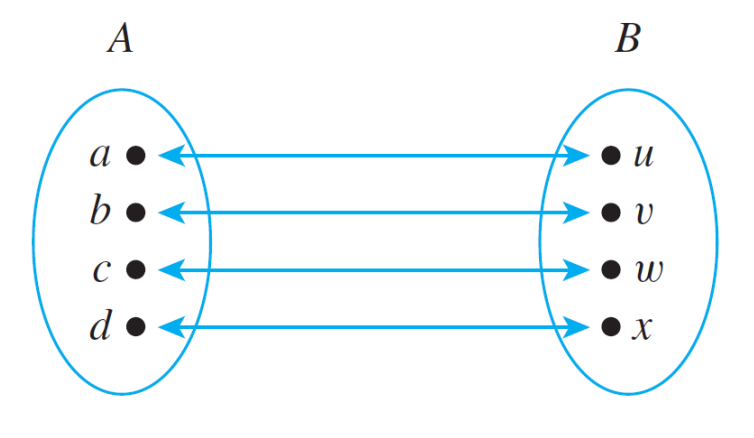 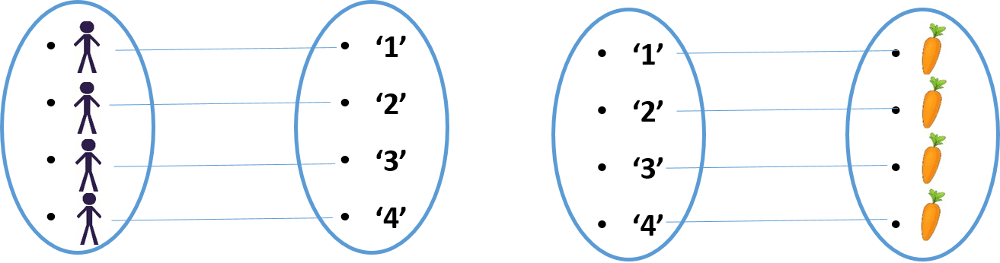

For humans one can distinguish between two ways of determining the number of elements:

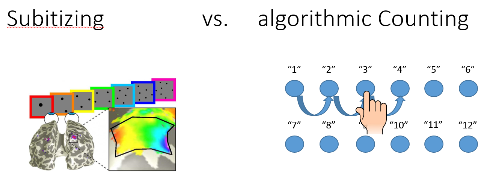

The algorithmic counting requires the following steps iteratively:
1) Recognize objects of interest
2) Picking an object of interest, that has not been counted yet
3) Update the counter in internal or external representation of numbers

Point 2. and 3. can be considered to require an internal memory of the agent.

A deeper understanding of numbers though is broadly considered more as gaining the result of counting (number associated with the last object counted), but with linking the result with the cardinality of the set. Unique tests to determine this understanding are not easy to design and any ideas are welcomed.

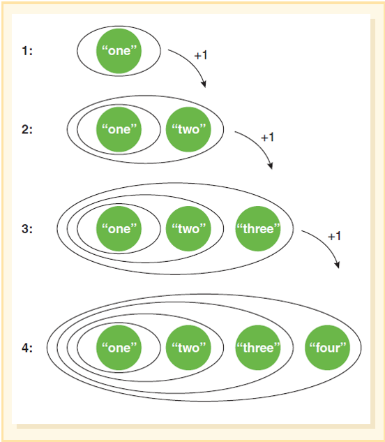

Other properties of numbers that should be captured by the comp. model are the following invariances:
- Permutation invariance
- Invariance under spatial transformations of the objects

## Computational Models
The above sketched aspects of counting and the understanding of numbers should be captured by computational models in this project.

### Subitizing
Motivated by the ability of humans to subitize small numbers of objects, the code in ... was developed, which is able to determine the number of randomly distributed squares with varying size by a one-shot approach where the picture of the squares is passed through a  feed-forward CNN.

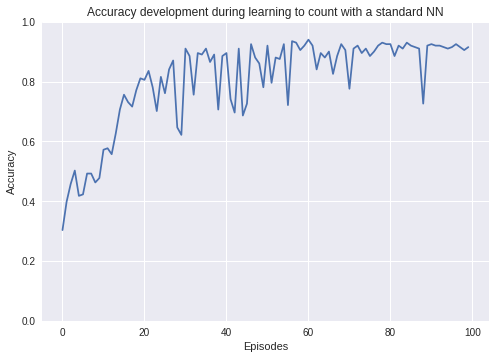

### Picking Objects (Binaries)
Point 2. of the above required steps to algorithmicly count - to decide which objects to pick one by one, has been modeled in a very basic setup of 1-D binary arrays in ... . Therefore the principle of Reinforcement learning with the method of Q-learning has been used. At each time step the whole binary array is given to the agent, whose goal it is to pick every 1 exactly once and without pickin any non-objects (zeros). Picking a binary at a certain position corresponds to an action in the action space. Thus the action space increases with the dimension of the input (not desired for more general setups).
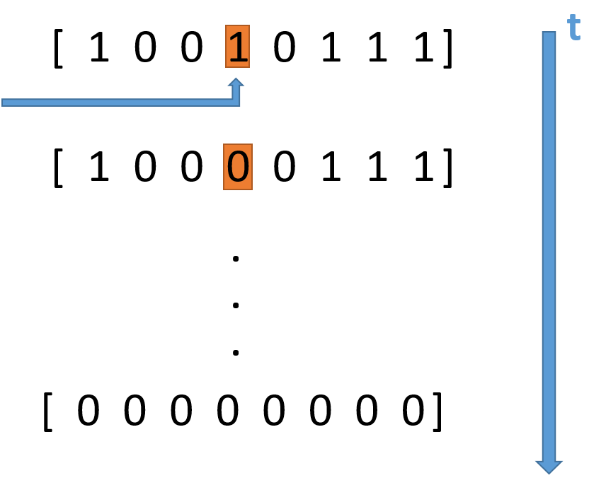
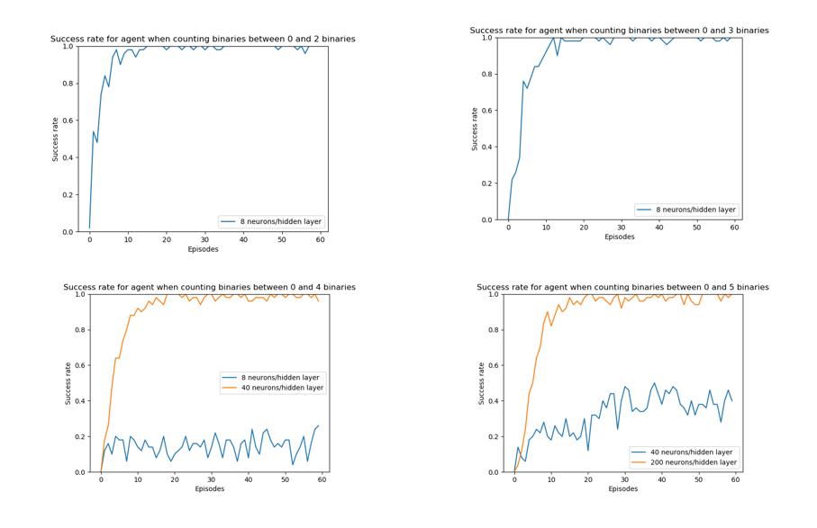

### Counting with sequence
To extend the idea of counting from just picking certain objects, the model in ... is capable of synchronizing each pick with a counting status. This requires an internal memory of the system (to know at which counter one is) and is resolved by using a RNN. In contrast to the picking example above, here the agent does not have the full binary array in sight at each time step, but strides from left to right and has one binary as observation at each time step. Each number is represented by an output node of the RNN.

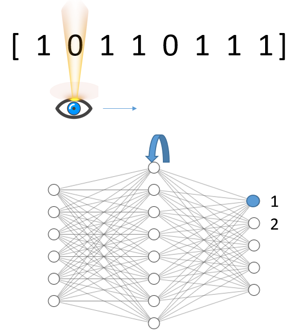

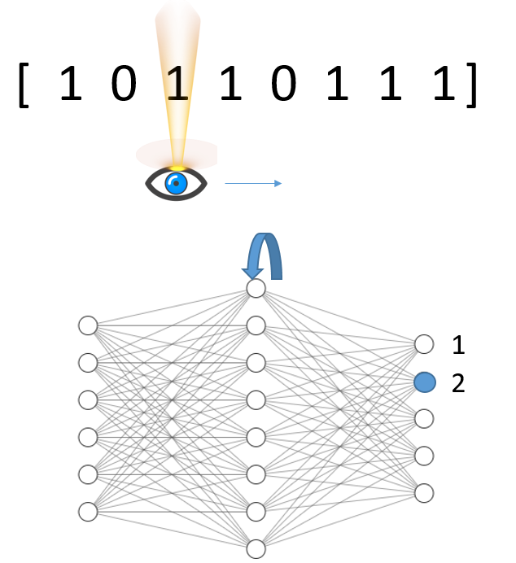

### A^n B^n 
The code in ... reproduces the model and results from the paper ... . Here the agent (non-RL) is exposed to a sequence of n 'A's followed by n 'B's (in my case 'A'->1,'B'->0). At each time step only one character is shown to the system. The goal of the agent is predict the next character at each time step. For the 'A's this is not possible, since the model cannot know how many 'A's there are going to be, but since there are as many 'Bs' as 'As' (which it has seen), it can in principle the number of 'Bs' before terminating.
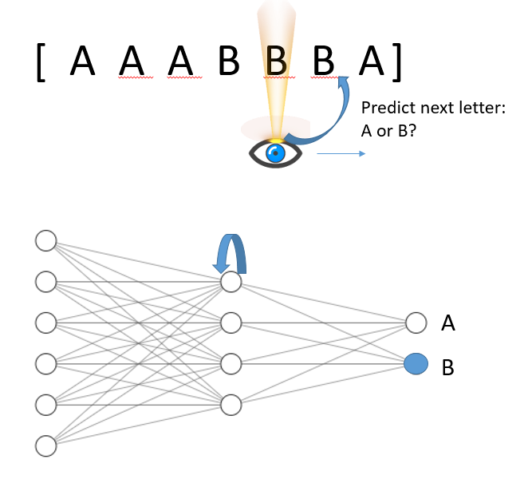

### RL with RNN and limited field of view
This model should combine many of the above stated and implemented aspects of counting. It is the main project now and should be the basis for an agent in a more human-like environment. 
The set-up of the model is is as followed:
An agent has a limited field of view (cannot see the whole state at each instant of time) of a 1|2-D binary. The possible actions of the agents are: Picking, Stopping, Moving attention/field of view to left, --|-- to the right, picking a number of the number sequence. There are several reasons why a limited visual field is modeled: First it mimics the visual field of humans. Second it reduces the amount of data, that has to processed at each time instant. Third it can focus only on relevant parts of the input. Fourth, a fixed size of visual field can be inbedded in environments of any size and are thus easier to generalize.  To remember at which counter the agent is and to wich regions to look at the agent is required to have an internal memory, which is modeled by a RNN. The learning process is based on reinforcement learning.

In prospect for a publication of the work, a succsessful model of this kind would capture the following novel or state-of-the-art aspects:
- Most other published counting models, the agent's main challange is the 'Which-object-to-pick-next' challenge and updating an external memory (e.g. shifting an external counter to the right, each time it picks an object, which correspons more to a reaction game). In our approach the agent has an internal memory modeled by the RNN, which keeps track of the current counter and needs to find an internal representation for that.
- Most application of RL-algorithms so far are focused on markov-processes, where the optimal action can be chosen just from the current state of the world. Some problems however require a memory from the history of the events in order to solve a problem, such as counting.
- It is in line with current trends of machine learning to process both, static and dynamic input sequentially instead of all in one 'shot': For static input, such as object recognition in images, with attention shifting and for dynamic input (e.g. videos) by taking only the current image as input, but having information about the past images without saving and stacking them together.
- It is a  step towards the agent in human-like environment (limited visual field, internal memory...)
 
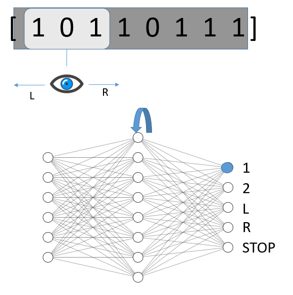

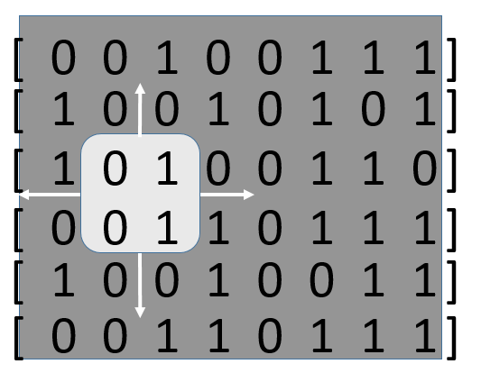 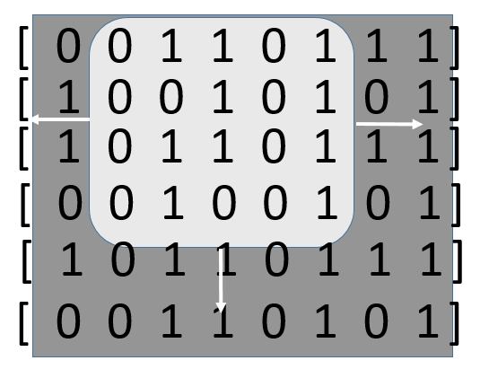

This model is in progress right now.

